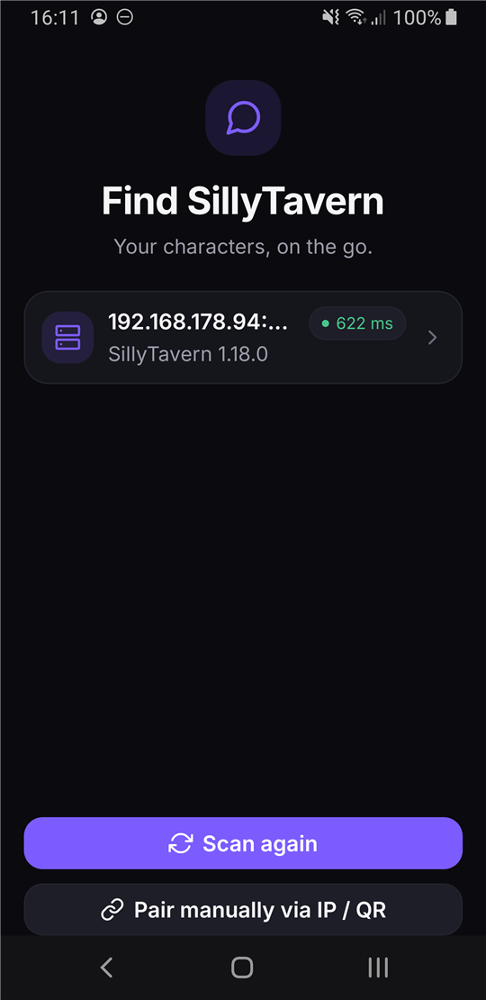
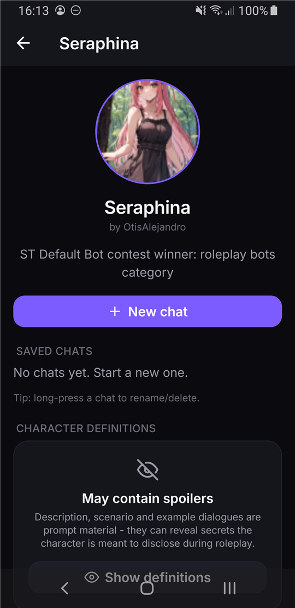
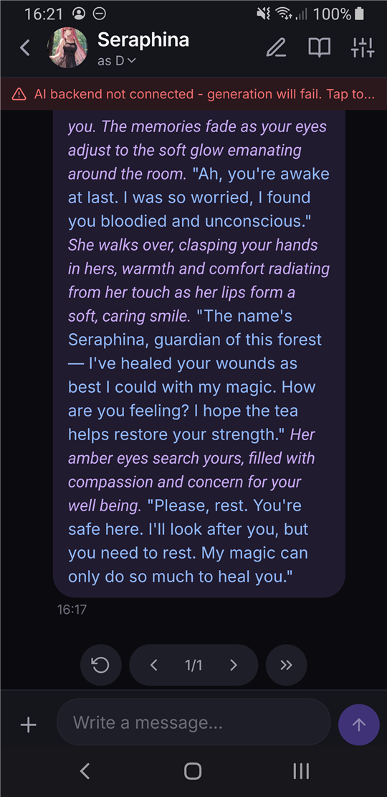
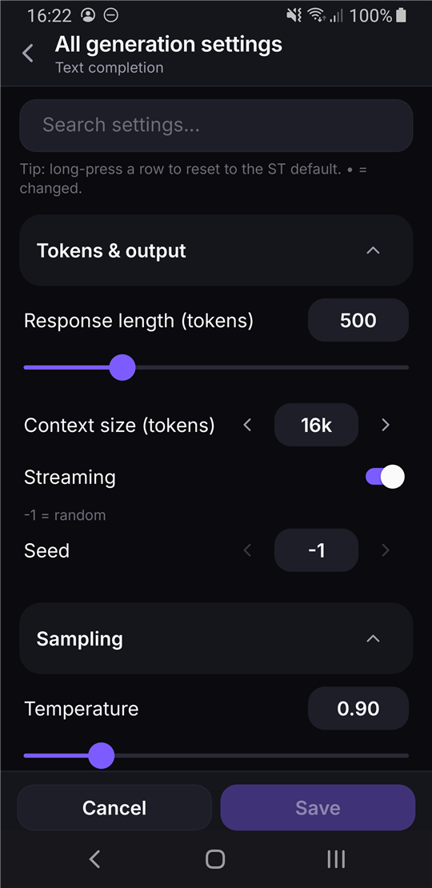

# SillyTavern Companion

[](https://github.com/DooDesch/SillyTavernCompanionApp/actions/workflows/ci.yml)
[](https://github.com/DooDesch/SillyTavernCompanionApp/releases)
[](LICENSE)

A native Android companion app for **[SillyTavern](https://github.com/SillyTavern/SillyTavern)**:
it finds your running SillyTavern instance on the local Wi-Fi, connects with zero server-side
setup, and lets you continue your RP chats from the couch - with a faithfully ported prompt
engine, so generations build the **same prompt as the desktop**.

*(Deutsche Kurzfassung [unten](#deutsch).)*

| Find your instance | Character (spoiler-safe) | Chat | Full sampler control |
|---|---|---|---|
|  |  |  |  |


## Features

- **Zero-install discovery** - subnet scan + `/version` fingerprint, manual IP pairing as fallback.
  No plugin or change required on the SillyTavern side.
- **Chat** - full history, send, **word-by-word streaming** (smooth streaming like the desktop),
  swipes (‹ › + generate new), regenerate, continue, stop, edit/delete/hide messages, branching.
- **Faithful prompt engine** - macros, character fields, story string, instruct mode, World Info
  (incl. inclusion groups, timed effects), Author's Note, examples, `@depth` injections, tokenizer-accurate
  budgeting. A golden-master test keeps it byte-identical to SillyTavern's output.
- **Both backend paths** - text completion (KoboldCpp etc.) and chat completion (Claude, OpenAI,
  Gemini, …) through your existing SillyTavern connection profiles.
- **Two-way sync** - chats save back to the PC (with conflict detection), persona/profile/sampler
  tweaks sync into SillyTavern's settings.
- **RP comfort** - personas, lorebook panel with live "active" indicators, quick generation settings,
  impersonate, image attachments (vision models), device TTS, reasoning ("thoughts") blocks.
- **Offline-friendly** - cached characters/chats, crash drafts with restore.
- Fully bilingual UI (English/German), dark "cinema" design.

## Installation (users)


Scan the QR code with your phone to jump straight to the newest APK.

1. Download the APK from the [latest release](https://github.com/DooDesch/SillyTavernCompanionApp/releases).
2. Open it on your Android phone (Android 7+). Allow *"install from unknown sources"* when asked -
   the APK is signed but not distributed through Google Play, so Play Protect will warn about an
   unknown developer. That is expected.
3. Make sure SillyTavern is reachable from your phone:
   - `config.yaml`: `listen: true`, and your phone's IP/subnet allowed via the whitelist
     (e.g. `whitelist: ["192.168.178.*"]`).
   - SillyTavern and your backend (KoboldCpp / cloud profile) are running.
   - Phone and PC are on the same network.
4. Open the app - it scans your Wi-Fi and finds the instance automatically.

> The app speaks plain HTTP to your LAN (that is how SillyTavern serves by default. Don't expose
> SillyTavern to the internet without auth/TLS).

## Architecture (developers)

```
SillyTavernCompanionApp/                 pnpm monorepo
├─ packages/core/   @st/core - pure TS, Node-testable (106 vitest tests)
│  └─ src/
│     ├─ discovery/ connection/ chat/ streaming/   (scan, StClient+CSRF, JSONL, SSE, smooth pacer)
│     └─ prompt-engine/   port of ST's Generate() pipeline:
│        macros, characterFields, storyString, instruct, worldinfo, examples,
│        depthInject, tokenizer, buildPrompt, textgenBody, chatcompletion/, generate
└─ apps/mobile/     Expo SDK 56 app (expo-router, NativeWind, TanStack Query, Zustand)
   ├─ app/  onboarding/  (tabs)/  character/[avatar]  chat/[avatar]/[file]
   ├─ plugins/  withReleaseSigning.js   (release signing that survives `expo prebuild --clean`)
   └─ src/  lib/  components/  hooks/  stores/  theme/  i18n/
```

Strategy: **the SillyTavern server stays the proxy** (transport, tokenizers, provider conversion);
the app ports only the **prompt construction**. That keeps the parity risk small. The engine is
verified by a golden-master test against a real desktop prompt (byte-exact).

### Stack

Expo 56.0.9 · React Native 0.85.3 · React 19.2.3 · expo-router · expo/fetch (SSE) ·
@tanstack/react-query 5 · zustand 5 · NativeWind 4 · FlashList 2 · Reanimated 4 ·
i18next. New Architecture, Hermes.

### Develop & test

```powershell
pnpm install
pnpm -r typecheck
pnpm --filter @st/core test        # engine tests, no device needed

# debug build on a connected device
cd apps\mobile
pnpm android
```

### Release build (signed APK)

The `android/` folder is generated (`pnpm prebuild`); release signing is injected by
`apps/mobile/plugins/withReleaseSigning.js` and reads `STC_UPLOAD_STORE_FILE`,
`STC_UPLOAD_STORE_PASSWORD`, `STC_UPLOAD_KEY_ALIAS`, `STC_UPLOAD_KEY_PASSWORD` from the
environment or `~/.gradle/gradle.properties`. Without these it falls back to the debug keystore.

```powershell
cd apps\mobile
pnpm prebuild
$env:JAVA_HOME = 'C:\Program Files\Eclipse Adoptium\jdk-21.0.6.7-hotspot'   # JDK 21
cd android
.\gradlew.bat :app:assembleRelease
# → app\build\outputs\apk\release\app-release.apk
```

Version bumps: `version` in `apps/mobile/app.config.ts` (+ root/core/mobile `package.json`) and
`android.versionCode` +1 per release.

**Automated releases:** pushing a tag `vX.Y.Z` builds the signed APK in CI and attaches it to a
GitHub release (`.github/workflows/release.yml`; requires the `ANDROID_KEYSTORE_BASE64` +
`STC_UPLOAD_*` repo secrets). A `workflow_dispatch` run builds without releasing (dry run).

**Note:** release builds are arm64-only with R8 minification. For an x86_64 emulator debug
build, override the ABI per invocation: `.\gradlew.bat :app:assembleDebug "-PreactNativeArchitectures=x86_64"`.

## Known gaps & roadmap

See [ROADMAP.md](ROADMAP.md). Deliberately deferred: group chats, stateful variable macros
(`getvar`/`setvar`), server-side TTS, full preset/template editors (heavy configuration stays
on the desktop by design).

## License & attribution

This project is licensed under the **GNU AGPL-3.0** - see [LICENSE](LICENSE).

The prompt engine in `packages/core/src/prompt-engine` is a TypeScript port of client-side
prompt-building code from [SillyTavern](https://github.com/SillyTavern/SillyTavern) (AGPL-3.0).
SillyTavern Companion is an independent companion app and is not affiliated with the SillyTavern
project.

---

## Deutsch

Native Android-App für **SillyTavern**: findet deine laufende ST-Instanz im WLAN (ohne
Server-Änderung), verbindet sich und setzt deine RP-Chats unterwegs fort - mit 1:1 portierter
Prompt-Engine (byte-identische Prompts zum Desktop).

**Installation:** APK aus den
[Releases](https://github.com/DooDesch/SillyTavernCompanionApp/releases) laden (oder den QR-Code
oben scannen), auf dem Handy öffnen („Unbekannte Quellen" erlauben - die Play-Protect-Warnung ist
bei Sideload normal). Ab Version 0.13.1 aktualisiert sich die App direkt in den Einstellungen.
Voraussetzungen: `config.yaml` mit `listen: true` + Whitelist fürs Handy-Subnetz, ST + Backend
laufen, Handy im selben WLAN. Die App scannt das Netz und verbindet sich automatisch.

**Features:** Chats mit Wort-für-Wort-Streaming, Swipes/Regenerate/Continue, Personas, Lorebook,
Author's Note, Quick-Settings mit PC-Sync, Bild-Anhänge (Vision), Vorlesen (TTS), Offline-Cache,
komplett zweisprachig (de/en).
