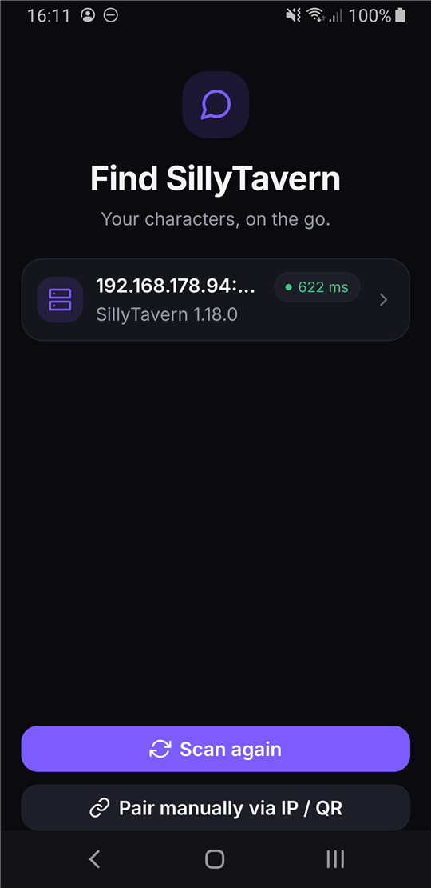
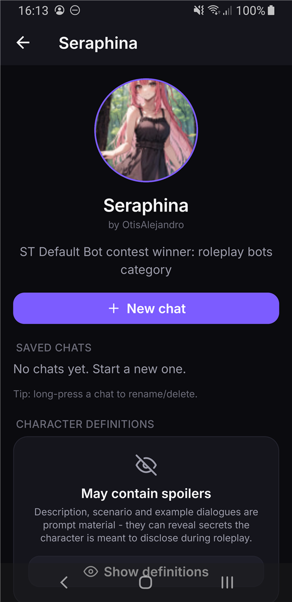
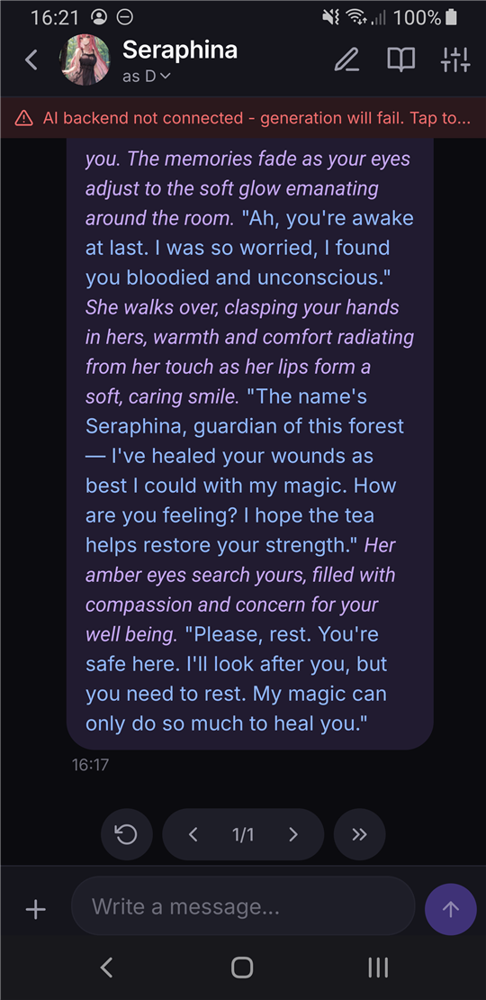
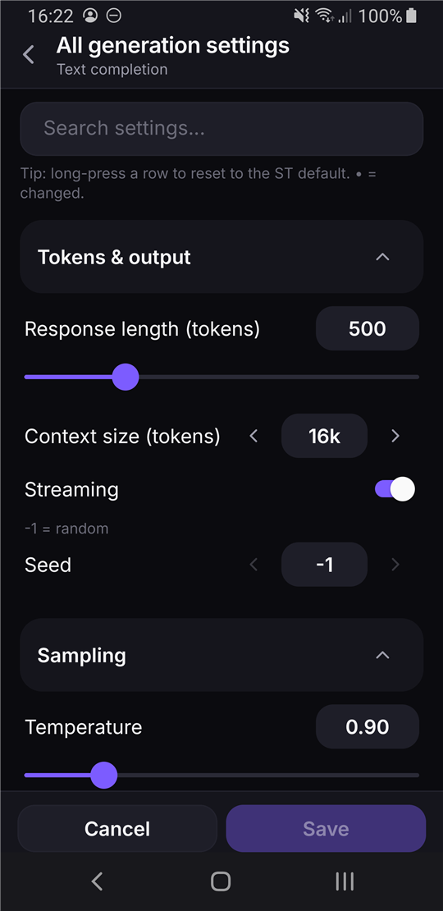

# SillyTavern Companion

> 🛟 **Need help or found a bug?** Get support at [support.doodesch.de/sillytaverncompanionapp](https://support.doodesch.de/sillytaverncompanionapp).

[](https://github.com/DooDesch/SillyTavernCompanionApp/actions/workflows/ci.yml)
[](https://github.com/DooDesch/SillyTavernCompanionApp/releases)
[](LICENSE)

An Android app for [SillyTavern](https://github.com/SillyTavern/SillyTavern). It finds the
SillyTavern instance on your home network and lets you carry on your chats from the phone.

Your PC keeps doing the work. Characters, chats, settings and the AI backend stay where they are,
and nothing has to be installed on the SillyTavern side. The app builds its prompts with a port of
SillyTavern's own prompt code, so a reply you generate on the phone gets the same prompt it would
get on the desktop.

Status: beta. Android 7 or newer, 64-bit ARM phones.

| Find your instance | Character page | Chat | Generation settings |
|---|---|---|---|
|  |  |  |  |

## What it does

**Connect**
- Scans the Wi-Fi for a running SillyTavern and connects to it. Manual pairing by IP and port is
  there for networks where the scan does not get through.
- Works with SillyTavern's Basic Auth and remembers more than one server.

**Chat**
- Replies stream in word by word, with the same smooth streaming option as the desktop.
- Swipes, regenerate, continue, stop, impersonate. Alternate greetings show up as swipes on the
  first message.
- Edit, copy, hide and delete messages, branch a chat, rename and delete chats.
- Reasoning blocks, image attachments for vision models (chat completion), read-aloud with the
  phone's text-to-speech.
- Markdown rendering that follows the desktop, including quoted speech and nested styles.

**Same prompt as the desktop**
- Macros, character fields, story string, instruct mode, example dialogues, Author's Note,
  `@depth` injections and persona positions.
- World Info with selective logic, inclusion groups, minimum activations and timed effects
  (sticky, cooldown, delay). A lorebook panel shows which entries are active and lets you mute
  single entries.
- Token budgets come from SillyTavern's tokenizers. Tests compare the built prompt and the request
  bodies with what the desktop produces.

**Settings on the phone**
- Pick the connection profile and the persona. Create, edit and delete personas.
- Quick settings for temperature, response length and context size, plus a full screen with every
  sampler SillyTavern offers for the active backend.
- Edit context templates, instruct templates and the system prompt.
- Changes go back to SillyTavern if you turn on "Sync with PC". Only the fields you touched are
  written.

**Around it**
- Chats are saved back to the PC, with a conflict check if the chat changed there in the meantime.
- Character pages hide the definitions until you ask for them, so you do not spoil a card by
  opening it.
- Cached characters and chats for reading offline, drafts survive a crash.
- Optional app lock with fingerprint or device PIN.
- English and German, picked from the phone language.

## Supported backends

The app does not talk to the AI backend directly. It sends the request to SillyTavern, and
SillyTavern forwards it like it does for the desktop. So the backend has to be set up and connected
in SillyTavern first.

| SillyTavern API | Covered |
|---|---|
| Text Completion | KoboldCpp, llama.cpp, Ollama, TabbyAPI, Text Generation WebUI, vLLM, Aphrodite, OpenRouter, Mancer, TogetherAI, InfermaticAI, DreamGen, Featherless, HuggingFace, Generic |
| Chat Completion | OpenAI, Claude, Google AI Studio, Vertex AI, OpenRouter, Mistral, Cohere, DeepSeek, xAI, Groq, Perplexity, Azure OpenAI, Custom and the other sources SillyTavern lists |
| NovelAI | Clio, Kayra, Erato |
| KoboldAI Classic | yes |
| AI Horde | yes, with queue position in the chat |

Not every backend has been run against a live server. If one misbehaves, please
[report it](https://support.doodesch.de/sillytaverncompanionapp).

## Install


1. Download the APK from the [releases page](https://github.com/DooDesch/SillyTavernCompanionApp/releases),
   or scan the QR code with your phone.
2. Open the APK on the phone and allow installing from this source when Android asks.

The APK is signed, but it does not come from Google Play. Play Protect warns about an unknown
developer because of that.

After the first install the app updates itself: it checks GitHub on launch, and
Settings > "Check for updates" downloads and installs the new version.

## Set up SillyTavern

SillyTavern only answers on the PC itself by default. To let the phone in, edit `config.yaml` in
your SillyTavern folder and restart SillyTavern:

```yaml
listen: true
whitelist:
  - ::1
  - 127.0.0.1
  - 192.168.178.*   # your home network, see the IP of your PC
```

Then:

1. Start SillyTavern and connect your AI backend in it, like you would for the desktop.
2. Put the phone on the same network as the PC.
3. Open the app. It scans the network and lists the instance.

If you use `basicAuthMode` in SillyTavern, choose "Pair manually" in the app and enter the username
and password there.

The app talks plain HTTP inside your network, the same way the SillyTavern web page does. Do not
expose SillyTavern to the internet without authentication and TLS.

## Troubleshooting

**The scan finds nothing.**
Check that `listen: true` is set and SillyTavern was restarted, that the phone's network is in the
whitelist, and that the firewall on the PC lets the SillyTavern port (8000 by default) through.
Guest Wi-Fi and some routers keep devices apart; pair manually with the IP and port of the PC in
that case.

**"AI backend not connected" or "No response".**
SillyTavern has no connection to the backend. Open SillyTavern on the PC, connect the API there and
check that a model is selected. In the app, Settings shows which connection profile is active.

**A reply looks different from the desktop.**
That is a bug worth reporting. Include the backend, the connection profile type and, if you can,
the request from the SillyTavern console.

## Not supported

- Group chats.
- Variable macros that keep state (`getvar`, `setvar`).
- SillyTavern's server-side TTS. The app reads aloud with the phone's own voice.
- iOS, and 32-bit Android phones.

Open work is on the [project board](https://github.com/users/DooDesch/projects/1), what shipped is
in the [changelog](CHANGELOG.md).

## Development

The repo is a pnpm monorepo: `packages/core` holds the prompt engine and the SillyTavern client in
plain TypeScript, `apps/mobile` is the Expo app. Setup, architecture, tests and the release build
are in [docs/DEVELOPMENT.md](docs/DEVELOPMENT.md).

## License and attribution

GNU AGPL-3.0, see [LICENSE](LICENSE).

The prompt engine in `packages/core/src/prompt-engine` is a TypeScript port of client-side
prompt-building code from [SillyTavern](https://github.com/SillyTavern/SillyTavern) (AGPL-3.0).
SillyTavern Companion is an independent app and is not affiliated with the SillyTavern project.
